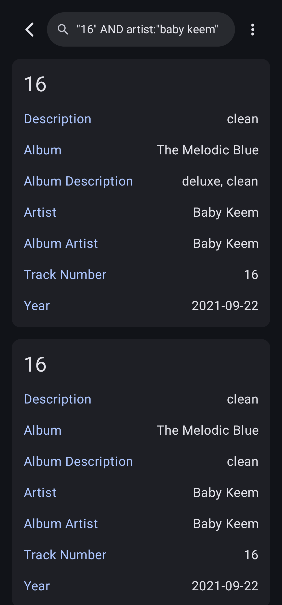

  

  # Lotus

  ### Music player for Android
  

## Screenshots

  

    
    
    
    
    
    
    
    
  

## Features
- Enjoy your favorite music in a variety of formats, including MP3, FLAC, OGG, WAV, and more
- Easily browse tracks, albums, artists, and genres, and create custom playlists
- Enhance your listening experience with synchronized lyrics from [LRCLIB](https://lrclib.net/)
- Manually update track details or fetch accurate info from [MusicBrainz](https://musicbrainz.org/)
- Designed with [Material You](https://m3.material.io/) and supports dynamic color palettes
